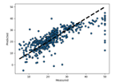
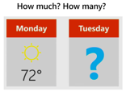
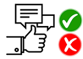
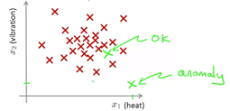
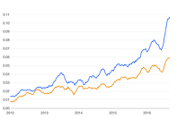

# ML.NET Samples

# Overview

[ML.NET](https://www.microsoft.com/net/learn/apps/machine-learning-and-ai/ml-dotnet) is a cross-platform open-source machine learning framework that makes machine learning accessible to .NET developers.

The official ML.NET samples are divided in three categories:
* **Getting started (C#)** - basic "hello world" samples for each ML task, in C#
* **Getting started (F#)** - basic "hello world" samples for each ML task, in F#
* **Examples** -  examples of how you can use various ML.NET components (learners/algorithms, transforms, etc. This is the area that will be growing significantly, covering many scenarios).
* **End-to-end  (C#)** - real world examples of web, desktop, mobile, and other applications infused with ML solutions via [ML.NET APIs](https://docs.microsoft.com/dotnet/api/?view=ml-dotnet).

For VB.NET samples, check this external repo supported by the community (Kudos for Nukepayload2):
https://github.com/Nukepayload2/machinelearning-samples/tree/master/samples/visualbasic

Since the list of examples will be growing and they will be covering many scenarios depending on ML tasks but also showing typical business problems to solve, the samples are classified by two pivots:
* ML Task or 
* Industry/business

# Samples Gallery classified by ML task/area 

## Binary classification
Type of problem: *Classify if something is A or B*

<table>
 <tr>
  <td>
      <h3><a href="TBD/Relative-URL">Sentiment Analysis classification</a></h3>
  </td>
  <td>
      <h3><a href="TBD/Relative-URL">Titanic Passenger Survival Prediction</a></h3>
  </td>
  <td>
      
  </td>
 </tr>
</table>

## Multi-class classification
Type of problem: *Classify something across multiple categories*

<table>
 <tr>
  <td>
      <h3><a href="TBD/Relative-URL">GitHub issues labeler</a></h3>
  </td>
  <td>
      <h3><a href="TBD/Relative-URL">Iris classification</a></h3>
  </td>
  <td>
      
  </td>
 </tr>
</table>

## Regression
Type of problem: *Predict a value, how much, how many, such as sales or weather forecast*

<table>
 <tr>
  <td>
      <h3><a href="TBD/Relative-URL">Taxi Fare Prediction</a></h3>
  </td>
  <td>
      <h3><a href="TBD/Relative-URL">Bike Sharing Demand</a></h3>
  </td>
  <td>
      <h3><a href="TBD/Relative-URL">Products Sales Forecast</a></h3>
  </td>
 </tr>
</table>

## Recommendations
Type of problem: *Recommend something, such as product or movie, based on other users' past usage or rating*

<table>
 <tr>
  <td>
      <h3><a href="TBD/Relative-URL">eCommerce product catalog recommender</a></h3>
  </td>
  <td>
      <h3><a href="TBD/Relative-URL">Movies recommender</a></h3>
  </td>
 </tr>

</table>

## Clustering
Type of problem: *Group things/concepts across initially unknown/unnamed groups or clusters*

<table>
 <tr>
  <td>
      <h3><a href="TBD/Relative-URL">Customer segmentation</a></h3>
  </td>
  <td>
      <h3><a href="TBD/Relative-URL">Clustering Iris Data</a></h3>
  </td>
 </tr>
</table>

## Anomaly Detection
Type of problem: *Detect issues/problems across items in a binary-based approach. True means anomaly detected. False means anomaly not detected*

<table>
 <tr>
  <td>
      <h3><a href="TBD/Relative-URL">Fraud detection in credit cards</a></h3>
  </td>
  <td>
      <h3><a href="TBD/Relative-URL">Sample 2 TBD</a></h3>
  </td>
  <td>
      <h3><a href="TBD/Relative-URL">Sample 3 TBD</a></h3>
  </td>
 </tr>

</table>

## Ranking

**Type of problem:** *Rank or order a list of items depending on certain interest. For example, ranking your product offering a the search page in a way that maximizes the probability of your items being sold.*

<table>
 <tr>
  <td>
      <h3><a href="TBD/Relative-URL">Sample 1 ML task</a></h3>
  </td>
  <td>
      <h3><a href="TBD/Relative-URL">Sample 2 ML task</a></h3>
  </td>
  <td>
      <h3><a href="TBD/Relative-URL">Sample 3 ML task</a></h3>
  </td>
 </tr>

</table>

## Time Series Forecasting
**Type of problem:** *Predict a value, how much, how many, such as sales forecast, but taking into account cycles/periods of time, such as seasons, influencing the prediction.*

<table>
 <tr>
  <td>
      <h3><a href="TBD/Relative-URL">Sample 1 ML task</a></h3>
  </td>
  <td>
      <h3><a href="TBD/Relative-URL">Sample 2 ML task</a></h3>
  </td>
  <td>
      <h3><a href="TBD/Relative-URL">Sample 3 ML task</a></h3>
  </td>
 </tr>

</table>

## Tensorflow model scoring
**Type of problem:** *Run/predict/score using an already trained Tensorflow model.*

<table>
 <tr>
  <td>
      <h3><a href="TBD/Relative-URL">Classify/Identify images</a></h3>
  </td>
  <td>
      <h3><a href="TBD/Relative-URL">Sentiment analysis of faces in photos</a></h3>
  </td>
  <td>
      <h3><a href="TBD/Relative-URL">Use TensorFlow model as featurizer in ML.NET</a></h3>
  </td>
 </tr>
</table>

# Samples Gallery classified by Industry/Business 

## Retail samples

<table>
 <tr>
  <td>
      <h3><a href="TBD/Relative-URL">eCommerce product catalog recommender</a></h3>
  </td>
  <td>
      <h3><a href="TBD/Relative-URL">Product sales forecast</a></h3>
  </td>
  <td>
      <h3><a href="TBD/Relative-URL">Movies recommender</a></h3>
  </td>
 </tr>
  <tr>
  <td>
      <h3><a href="TBD/Relative-URL">Customer reviews sentiment analysis</a></h3>
  </td>
 </tr>
</table>

## Transport & travel samples

<table>
 <tr>
  <td>
      <h3><a href="TBD/Relative-URL">Taxi Fare Prediction</a></h3>
  </td>
  <td>
      <h3><a href="TBD/Relative-URL">Bike Sharing Demand</a></h3>
  </td>
 </tr>
</table>

## Financial services samples

<table>
 <tr>
  <td>
      <h3><a href="TBD/Relative-URL">CC Fraud Detection</a></h3>
  </td>
 </tr>
</table>

## Marketing

<table>
 <tr>
  <td>
      <h3><a href="TBD/Relative-URL">Customer segmentation</a></h3>
  </td>
 </tr>
</table>

## Education & research samples

<table>
 <tr>
  <td>
      <h3><a href="TBD/Relative-URL">Iris classification</a></h3>
  </td>
  <td>
      <h3><a href="TBD/Relative-URL">Clustering Iris Data</a></h3>
  </td>
  <td>
      <h3><a href="TBD/Relative-URL">Titanic Passenger Survival Prediction</a></h3>
  </td>
 </tr>
</table>

## Development & computing

<table>
 <tr>
  <td>
      <h3><a href="TBD/Relative-URL">GitHub issues labeler</a></h3>
  </td>
 </tr>
</table>

## Any industry/business

<table>
 <tr>
  <td>
      <h3><a href="TBD/Relative-URL">Classify/Identify images</a></h3>
  </td>
  <td>
      <h3><a href="TBD/Relative-URL">Sentiment analysis of faces in photos</a></h3>
  </td>
  <td>
      <h3><a href="TBD/Relative-URL">Use TensorFlow model as featurizer in ML.NET</a></h3>
  </td>
 </tr>
</table>

# NuGet packages to use
Until ML.NET is released as final v1.0, most of the samples in this repo will be using preview released versions (i.e. v0.6, v0.7, etc.) available at NuGet (using released  [Microsoft.ML](https://www.nuget.org/packages/Microsoft.ML/) NuGet packages). However, a few of the samples might also be using nightly releases available at MyGet using this feed: https://dotnet.myget.org/F/dotnet-core/api/v3/index.json. 

In addition, if you would like to explore the examples directly referencing the source code of ML.NET, check out [scenario tests](https://github.com/dotnet/machinelearning/tree/master/test/Microsoft.ML.Tests/Scenarios) in [ML.NET repository](https://github.com/dotnet/machinelearning).

## Learn more

See [ML.NET Guide](https://docs.microsoft.com/en-us/dotnet/machine-learning/) for detailed information on tutorials, ML basics, etc.

## API reference

Check out the [ML.NET API Reference](https://docs.microsoft.com/dotnet/api/?view=ml-dotnet) to see the breadth of APIs available.

## Contributing

We welcome contributions! Please review our [contribution guide](CONTRIBUTING.md).

## Community

Please join our community on Gitter 

This project has adopted the code of conduct defined by the [Contributor Covenant](http://contributor-covenant.org/) to clarify expected behavior in our community.
For more information, see the [.NET Foundation Code of Conduct](https://dotnetfoundation.org/code-of-conduct).

## License

[ML.NET Samples](https://github.com/dotnet/machinelearning-samples) are licensed under the [MIT license](LICENSE).
